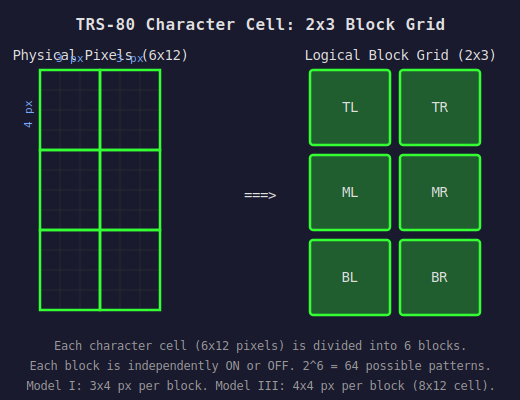
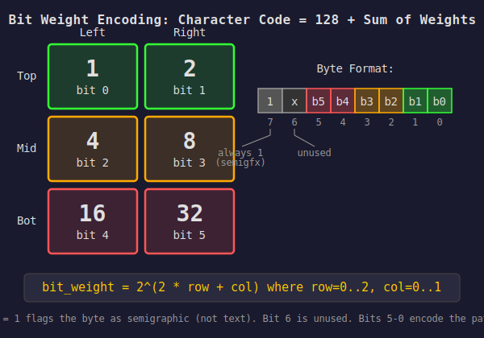
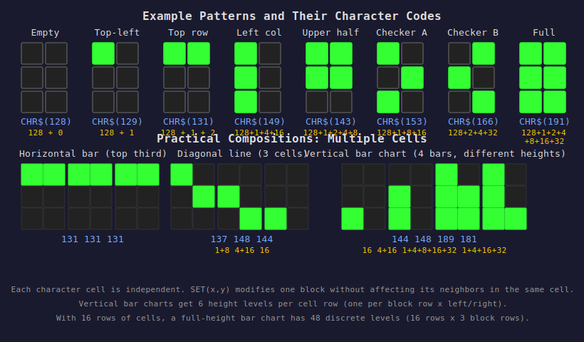
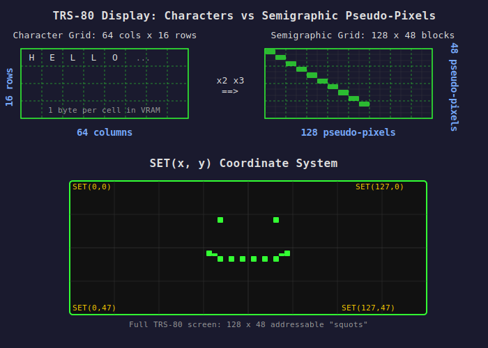
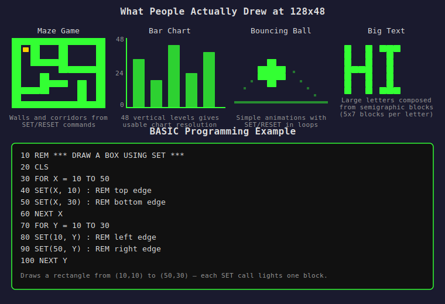

# TRS-80 Semigraphics (Block Mosaic) System

## The Big Idea

The TRS-80 Model I (1977) had no bitmap graphics hardware. Its display was text-only: 64 columns x 16 rows of characters. But Radio Shack included a clever hack: 64 special "semigraphic" characters that divide each character cell into a **2x3 grid of blocks**. Each block is either on or off. By combining these characters, you get a crude but usable **128x48 pseudo-pixel display** — entirely in text mode, with no graphics hardware at all.

This is the same concept later used by Teletext (broadcast TV information services) and, much later, by Unicode Braille patterns in modern terminals.

## The Character Cell

Each TRS-80 character cell is **6x12 actual pixels** (Model I) or **8x12 pixels** (Model III). The semigraphic characters divide this cell into a 2-column by 3-row grid of "blocks" (sometimes called "squots"):



Each block is either **fully lit** (foreground color) or **fully dark** (background). No partial fills, no shading — strictly binary.

## Bit Encoding

Here's the key insight: **the 6 blocks map directly to 6 bits**, giving exactly 2^6 = **64 combinations**. The character codes occupy $80-$BF (decimal 128-191):

```
Character code = 128 + (sum of lit block weights)
```

The bit weights are:



So each block has a power-of-two weight. You just add up the weights of the blocks you want lit, add 128, and that's your character code.

## Examples



Some concrete examples:

| Pattern | Lit blocks | Calculation | Code |
|---------|-----------|-------------|------|
| Empty (all off) | none | 128 + 0 | CHR$(128) |
| Top-left only | TL | 128 + 1 | CHR$(129) |
| Top row | TL + TR | 128 + 1 + 2 | CHR$(131) |
| Left column | TL + ML + BL | 128 + 1 + 4 + 16 | CHR$(149) |
| Diagonal | TL + MR + BL | 128 + 1 + 8 + 16 | CHR$(153) |
| Checkerboard A | TL + MR + BL | 128 + 1 + 8 + 16 | CHR$(153) |
| Checkerboard B | TR + ML + BR | 128 + 2 + 4 + 32 | CHR$(166) |
| Full block | all | 128 + 1+2+4+8+16+32 | CHR$(191) |

## The Effective Display

The TRS-80 screen is 64 characters wide and 16 rows tall. Each character cell contains a 2x3 block grid. So the effective semigraphic resolution is:

```
Horizontal: 64 columns x 2 blocks = 128 pseudo-pixels
Vertical:   16 rows x 3 blocks    =  48 pseudo-pixels
```



This gives you a **128x48** addressable grid — coarse by any standard, but enough for simple games, bar charts, and crude drawings.

## BASIC Programming: SET and RESET

TRS-80 Level II BASIC provides three commands for semigraphic programming:

```basic
SET(x, y)       ' Turn ON the block at position (x, y)
RESET(x, y)     ' Turn OFF the block at position (x, y)
POINT(x, y)     ' Returns -1 if block is on, 0 if off
```

Coordinates: x = 0..127 (left to right), y = 0..47 (top to bottom).

**What SET does internally:**

1. Converts (x, y) to a character cell position:
   - `char_col = x / 2` (integer division)
   - `char_row = y / 3` (integer division)
2. Converts to a video RAM address:
   - `vram_addr = $3C00 + char_row * 64 + char_col`
3. Determines which bit to set:
   - `sub_col = x MOD 2` (0 = left, 1 = right)
   - `sub_row = y MOD 3` (0 = top, 1 = middle, 2 = bottom)
   - `bit_weight = 2^(2 * sub_row + sub_col)`
4. Reads the current byte at vram_addr
5. If it's not already a semigraphic char (bit 7 not set), replaces it with 128 (empty)
6. ORs in the bit_weight
7. Writes back

This means SET is **non-destructive** — it only turns on the one block you specify, preserving all other blocks in that cell.

## POKE: The Fast Way

SET/RESET are convenient but slow (interpreted BASIC). For speed, programmers wrote directly to video RAM:

```basic
' Video RAM is at $3C00 (15360 decimal), 1024 bytes (64 x 16)
POKE 15360 + row * 64 + col, 128 + pattern
```

Where `pattern` is the pre-computed sum of bit weights. This is much faster because you set all 6 blocks in a cell at once, with no read-modify-write cycle.

**Common technique — string packing:** Pre-build entire screen rows as strings of CHR$() values, then PRINT them in one shot:

```basic
10 A$ = ""
20 FOR I = 0 TO 63
30   A$ = A$ + CHR$(128 + calculated_pattern(I))
40 NEXT I
50 PRINT @ 0, A$;    ' blast entire row to screen
```

## What It Looked Like

The visual quality is... chunky. Each "pixel" is physically 3x4 actual pixels on Model I (4x4 on Model III). But within those constraints, people drew:



- **Maze games** (Rat's Revenge, Android Nim)
- **Bar charts** for data visualization
- **Simple animations** (bouncing balls, scrolling landscapes)
- **Crude diagrams** (circuit layouts, floor plans)
- **Big text** composed from block characters

The 128x48 grid is roughly equivalent to a 43x16 "pixel art canvas" if you think in terms of square pixels — each pseudo-pixel is wider than it is tall on Model I.

## Hardware Implementation

The semigraphic characters were **not stored in a character ROM** like the text characters. Instead, the TRS-80 used TTL combinational logic to decode the 6 data bits directly from video RAM in real time. When the video hardware encountered a byte with bit 7 set, it switched from the character generator ROM to the TTL block decoder. This is why all 64 combinations were available without needing 64 entries in a character ROM — the patterns are generated combinatorially from the bits.

## Why This Matters for N8

The TRS-80 mosaic system demonstrates that a **text-only display** can provide useful graphics capability through block subdivision. The N8's proposed charset includes this same concept:

| | TRS-80 | N8 Primary | N8 Graphics Mode |
|---|--------|-----------|-----------------|
| Grid | 2x3 | Various (halves, quarters, thirds) | 2x3 (full 64) |
| Combinations | 64 | 32 block elements | 64 mosaics |
| Cell size | 6x12 or 8x12 | 8x16 | 8x16 |
| Pseudo-pixel res | 128x48 | 160x50 (quadrants) | 160x75 (80x25 mode) |
| Encoding | Bit-packed in char code | Separate code points | Bit-packed at $80-$BF |

The N8's Charset 1 ("Graphics Mode") uses the same bit-encoding trick: character code = $80 + 6-bit pattern. This gives firmware and programs the same "SET pixel, RESET pixel" capability that TRS-80 BASIC provided.
